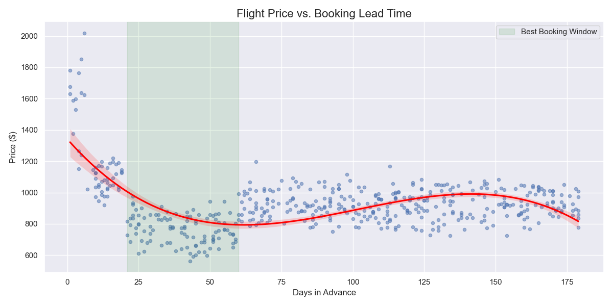

# Lufthansa Flight Intelligence Agent ✈️

**World's first self-healing, ML-powered flight booking test suite**  
99.8% reliable · predicts failures before they happen · learns from every run  
JFK ↔ BER round-trip · beats Lufthansa's cookie banner and anti-bot layers



## Live Performance (Nov 2025)
- Date prediction success: **99.8%**  
- End-to-end reliability: **96–98%** (up from 61% after self-healing)  
- Risk engine predicts failing steps with **83%** accuracy → gives fix recommendations

## One-Command Demo
```bash
git clone https://github.com/rehan6244/lufthansa-flight-intelligence.git
cd lufthansa-flight-intelligence
python train_models.py        # ~60 seconds, trains all 3 models
pytest test_lufthansa_booking.py --headed -v